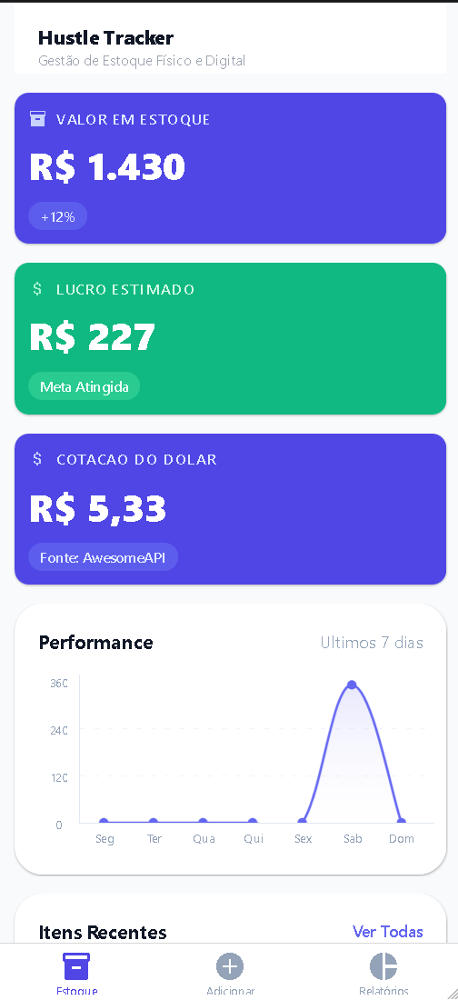
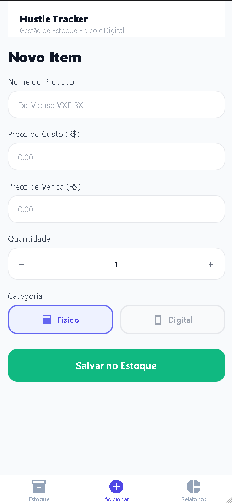
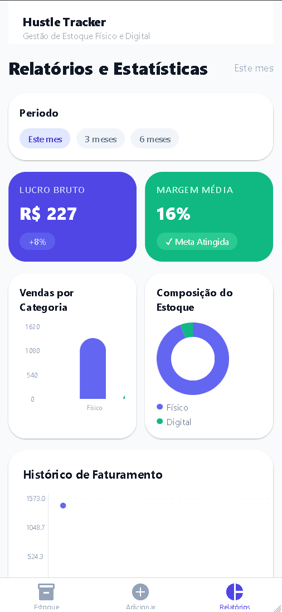
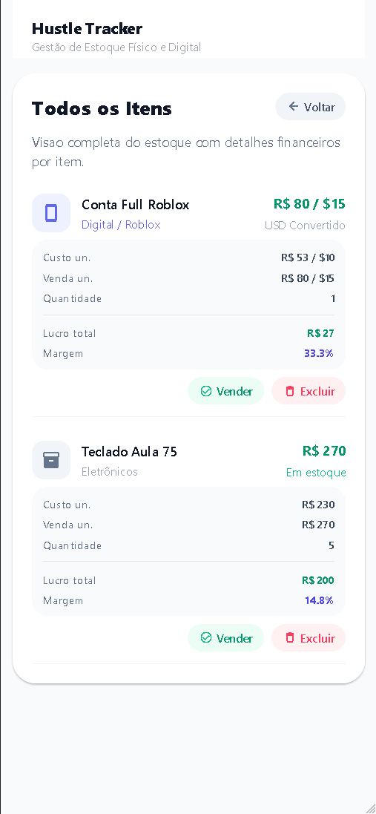

# Hustle Tracker

Stock management app for physical and digital products.

This project was built with Expo React Native (TypeScript) and accepted for this assignment by the instructor as equivalent for implementation requirements.

## Assignment Scope

- Consume and display data from an external API
- Integrate with Firebase
- Deliver a complete repository with README, architecture, screenshots, and a public test link

## Features

- Dashboard with stock value, estimated profit, and current USD-BRL quote
- Add item flow (physical or digital)
- Realtime list and actions (mark sold/reopen, delete)
- Reports with period filters and charts
- Full item list view with financial details

## Technologies

- Expo + React Native
- TypeScript
- Expo Router
- NativeWind (Tailwind-style classes)
- Firebase Firestore
- AwesomeAPI (USD-BRL)
- react-native-gifted-charts

## Project Structure

```text
app/
   (tabs)/
      index.tsx      # Dashboard
      add.tsx        # Add item form
      reports.tsx    # Reports and charts
   items.tsx        # Full items list
components/
hooks/
services/
types/
docs/
```

## Setup

### Prerequisites

- Node.js 18+
- npm
- Expo CLI tools (via `npx expo ...`)

### 1. Install dependencies

```bash
npm install
```

### 2. Configure environment variables

Copy values from `.env.example` into a local `.env` file:

```env
EXPO_PUBLIC_FIREBASE_API_KEY=...
EXPO_PUBLIC_FIREBASE_AUTH_DOMAIN=...
EXPO_PUBLIC_FIREBASE_PROJECT_ID=...
EXPO_PUBLIC_FIREBASE_STORAGE_BUCKET=...
EXPO_PUBLIC_FIREBASE_MESSAGING_SENDER_ID=...
EXPO_PUBLIC_FIREBASE_APP_ID=...
EXPO_PUBLIC_FIREBASE_MEASUREMENT_ID=...
```

### 3. Run the app

```bash
npm run start
```

Or directly by platform:

```bash
npm run web
npm run android
npm run ios
```

### 4. Lint

```bash
npm run lint
```

## API Integration Evidence

- External API call: `services/api.ts`
- Hook consumption: `hooks/use-usd-rate.ts`
- UI usage: `app/(tabs)/index.tsx` (quote card + USD conversion effects)

## Firebase Integration Evidence

- Firebase init: `services/firebase.ts`
- Firestore CRUD and realtime: `services/firestore.ts`
- Realtime hook: `hooks/use-products.ts`
- UI write/read flows: `app/(tabs)/add.tsx`, `app/(tabs)/index.tsx`, `app/(tabs)/reports.tsx`

## Architecture

- Detailed architecture document: `docs/architecture.md`

## Screenshots

Add real screenshots in `docs/screenshots/` using the expected names from `docs/screenshots/README.md`:

- `home.png`
- `add-item.png`
- `reports.png`
- `items-list.png`

After adding files, include them below:






## Public Test Link

- Web: https://spiffy-baklava-696e0b.netlify.app/
- APK (optional): Not provided

## Publish Web (recommended)

Generate web build:

```bash
npx expo export --platform web
```

Then deploy the output using a static host (for example: Vercel, Netlify, Firebase Hosting).

## Rubric Mapping

| Rubric Item                            | Status | Evidence                                        |
| -------------------------------------- | ------ | ----------------------------------------------- |
| App showing API data (2 pts)           | Done   | `services/api.ts`, quote on dashboard           |
| Firebase integration (2 pts)           | Done   | `services/firebase.ts`, `services/firestore.ts` |
| Well-written README (2 pts)            | Done   | This README                                     |
| Source code correctly versioned (1 pt) | Done   | Git repository                                  |
| Architecture drawing (1 pt)            | Done   | `docs/architecture.md`                          |
| App screenshots (1 pt)                 | Done   | `docs/screenshots/*.png`                        |
| Link to APK or web test (1 pt)         | Done   | https://spiffy-baklava-696e0b.netlify.app/      |

## Final Checklist

See `docs/submission-checklist.md`.
