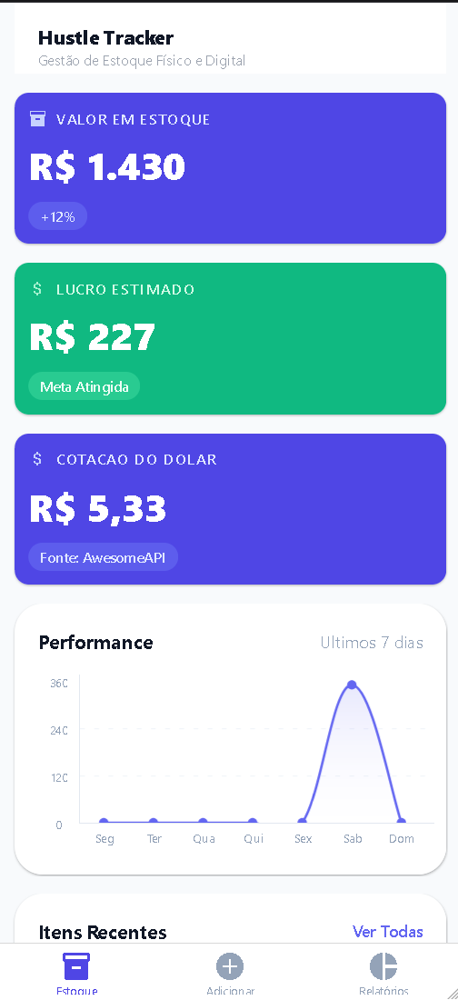
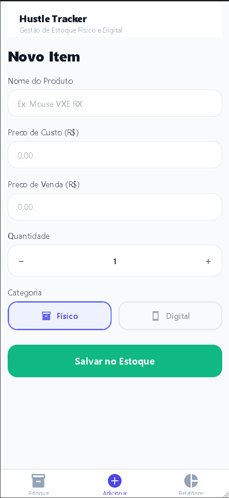
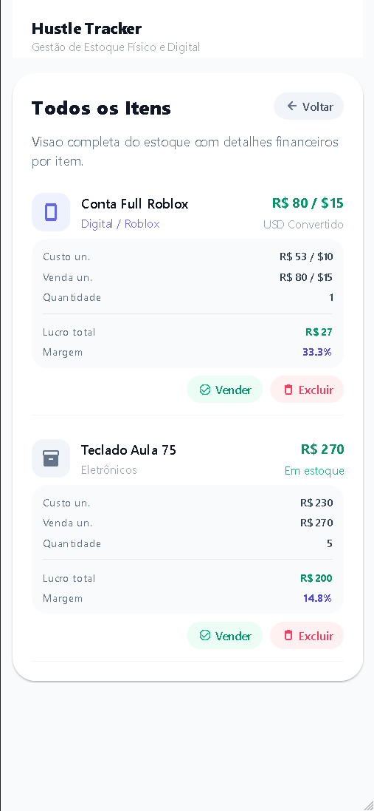

# Hustle Tracker

Aplicativo de controle de estoque para produtos físicos e digitais.

Este projeto foi desenvolvido com Expo React Native (TypeScript) e aceito pelo professor como equivalente aos requisitos de implementação do trabalho.

## Escopo do Trabalho

- Consumir e exibir dados de uma API externa
- Integrar com Firebase
- Entregar repositório completo com README, arquitetura, prints e link público para teste

## Funcionalidades

- Dashboard com valor em estoque, lucro estimado e cotação atual USD-BRL
- Fluxo de cadastro de item (físico ou digital)
- Lista em tempo real com ações (marcar como vendido/reabrir, excluir)
- Relatórios com filtros por período e gráficos
- Tela completa de itens com detalhes financeiros

## Tecnologias

- Expo + React Native
- TypeScript
- Expo Router
- NativeWind (classes no estilo Tailwind)
- Firebase Firestore
- AwesomeAPI (USD-BRL)
- react-native-gifted-charts

## Estrutura do Projeto

```text
app/
   (tabs)/
      index.tsx      # Dashboard
      add.tsx        # Formulário de cadastro
      reports.tsx    # Relatórios e gráficos
   items.tsx        # Lista completa de itens
components/
hooks/
services/
types/
docs/
```

## Configuração

### Pré-requisitos

- Node.js 18+
- npm
- Ferramentas Expo CLI (via `npx expo ...`)

### 1. Instalar dependências

```bash
npm install
```

### 2. Configurar variáveis de ambiente

Copie os valores de `.env.example` para um arquivo local `.env`:

```env
EXPO_PUBLIC_FIREBASE_API_KEY=...
EXPO_PUBLIC_FIREBASE_AUTH_DOMAIN=...
EXPO_PUBLIC_FIREBASE_PROJECT_ID=...
EXPO_PUBLIC_FIREBASE_STORAGE_BUCKET=...
EXPO_PUBLIC_FIREBASE_MESSAGING_SENDER_ID=...
EXPO_PUBLIC_FIREBASE_APP_ID=...
EXPO_PUBLIC_FIREBASE_MEASUREMENT_ID=...
```

### 3. Executar o app

```bash
npm run start
```

Ou diretamente por plataforma:

```bash
npm run web
npm run android
npm run ios
```

### 4. Lint

```bash
npm run lint
```

## Evidências de Integração com API

- Chamada da API externa: `services/api.ts`
- Consumo via hook: `hooks/use-usd-rate.ts`
- Uso na interface: `app/(tabs)/index.tsx` (card de cotação + conversão em USD)

## Evidências de Integração com Firebase

- Inicialização do Firebase: `services/firebase.ts`
- CRUD e tempo real no Firestore: `services/firestore.ts`
- Hook com atualização em tempo real: `hooks/use-products.ts`
- Fluxos de escrita/leitura na interface: `app/(tabs)/add.tsx`, `app/(tabs)/index.tsx`, `app/(tabs)/reports.tsx`

## Arquitetura

- Documento detalhado da arquitetura: `docs/architecture.md`

## Prints da Aplicação

Os prints da aplicação já estão incluídos em `docs/screenshots/` com os seguintes nomes:

- `home.png`
- `add-item.png`
- `reports.png`
- `items-list.png`

Pré-visualização:






## Link Público para Teste

- Web: https://spiffy-baklava-696e0b.netlify.app/

## Publicar Versão Web (recomendado)

Gerar build web:

```bash
npx expo export --platform web
```

Depois, publique a saída em um host estático (por exemplo: Vercel, Netlify, Firebase Hosting).

## Mapeamento da Rubrica

| Item da Rubrica                                       | Status | Evidência                                       |
| ----------------------------------------------------- | ------ | ----------------------------------------------- |
| Aplicação exibindo dados de API (2 pts)               | Feito  | `services/api.ts`, cotação no dashboard         |
| Integração com Firebase (2 pts)                       | Feito  | `services/firebase.ts`, `services/firestore.ts` |
| README bem feito com instruções e tecnologias (2 pts) | Feito  | Este README                                     |
| Código-fonte corretamente versionado (1 pt)           | Feito  | Repositório Git                                 |
| Desenho da arquitetura da aplicação (1 pt)            | Feito  | `docs/architecture.md`                          |
| Prints da aplicação (1 pt)                            | Feito  | `docs/screenshots/*.png`                        |
| Link para testar versão web ou baixar APK (1 pt)      | Feito  | https://spiffy-baklava-696e0b.netlify.app/      |
