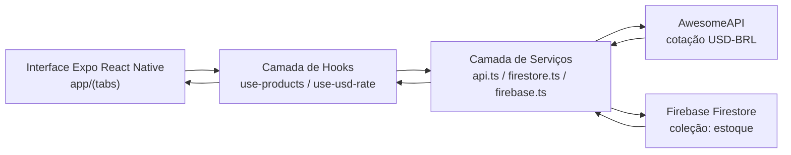

# Arquitetura

Este arquivo documenta a arquitetura exigida no trabalho.

## Fluxo de alto nível

## Camadas

1. Camada de Interface (UI)

- Telas e componentes em `app/` e `components/`.
- Exibe métricas de estoque, gráficos de relatórios, formulário de cadastro e lista de itens.

2. Camada de Hooks

- `hooks/use-products.ts`: assina dados em tempo real do Firestore.
- `hooks/use-usd-rate.ts`: carrega a cotação da AwesomeAPI.

3. Camada de Serviços

- `services/firestore.ts`: CRUD e normalização de produtos.
- `services/firebase.ts`: inicialização do Firebase e Firestore.
- `services/api.ts`: chamada HTTP para AwesomeAPI.

4. Fontes de Dados

- Firestore para persistência dos itens de estoque.
- AwesomeAPI para dados externos de cotação.

## Propriedade dos dados

- Fonte de verdade dos produtos: Firestore (`estoque`).
- Fonte de verdade da cotação: AwesomeAPI (com fallback local no hook).
